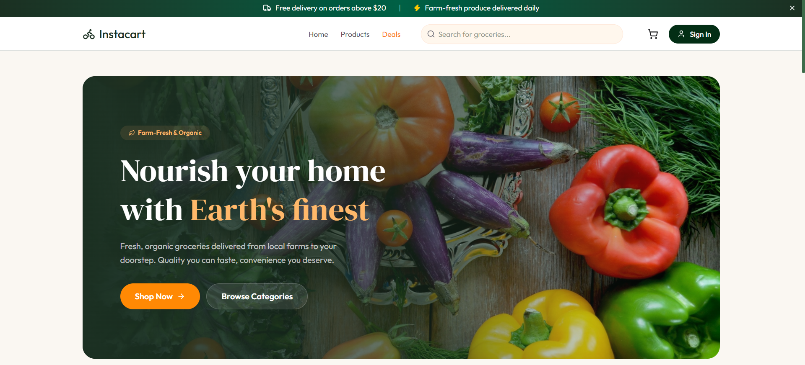
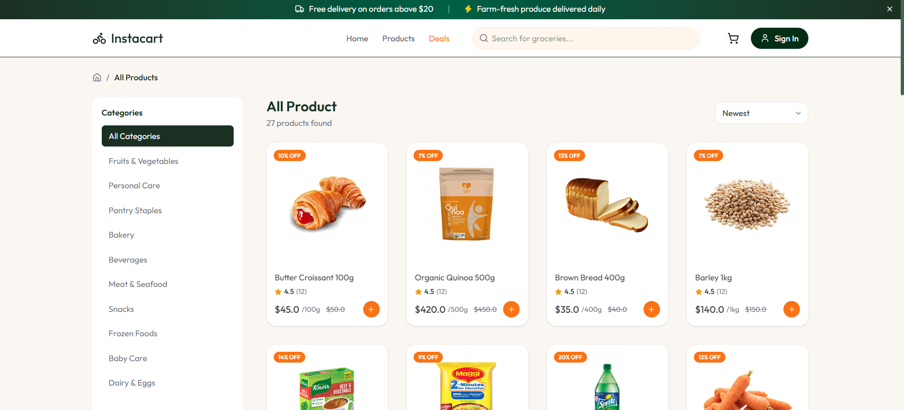
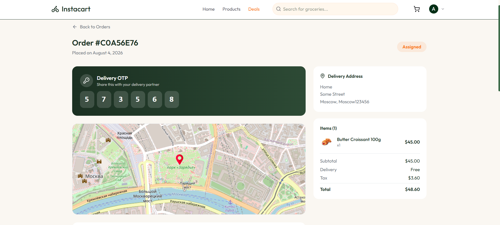
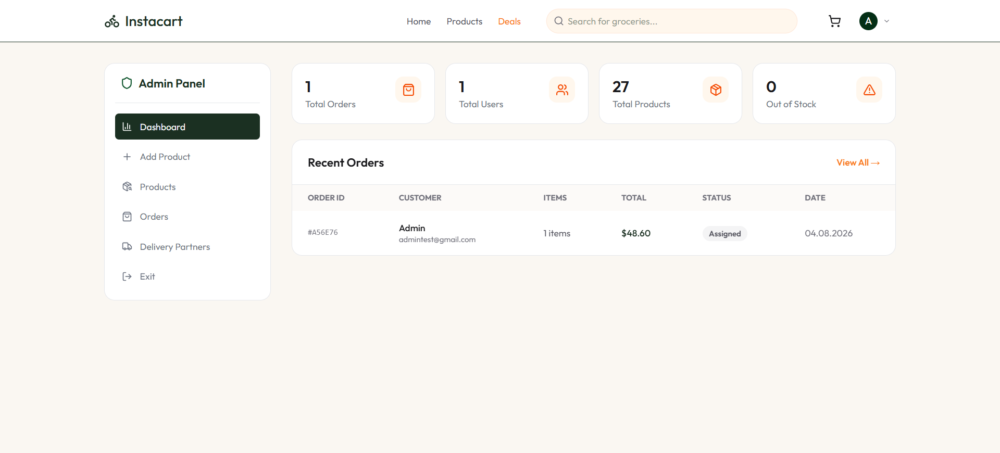
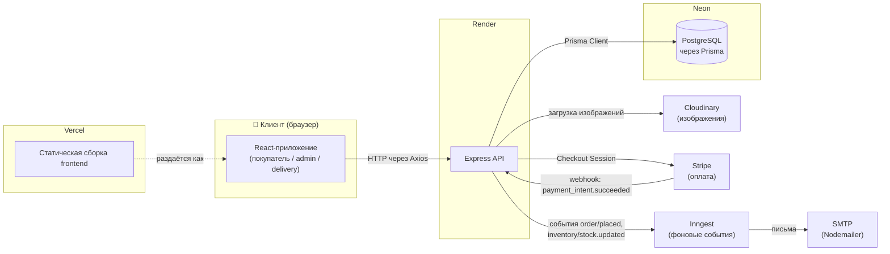
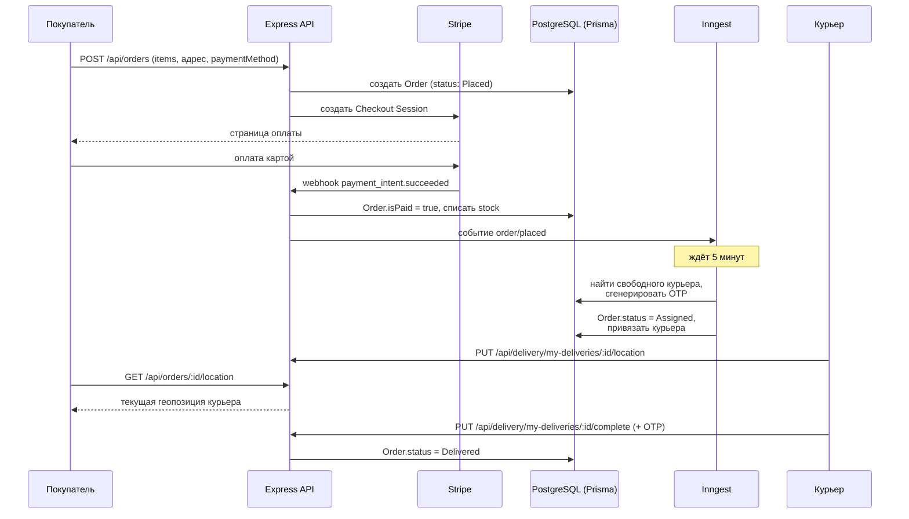

# 🛒 GroceryExpress

**Интернет-магазин по доставке продуктов с живым отслеживанием курьера на карте, авто-назначением доставки и отдельными панелями для администратора и курьера.**

[](https://grocery-express-theta.vercel.app/)


🔗 **Рабочая версия:** [grocery-express-theta.vercel.app](https://grocery-express-theta.vercel.app/)

---

## 📸 Превью




# Админ панель и курьеры доступны только в локальных сборках, для этого в .env ADMIN_EMAILS сервера укажите любую почту и зарегистрируйтесь по ней на сайте, так вы получите админ доступ (для курьеров нужно будет создать в админке курьера и через /delivery/login войти)!!!

## Содержание

- [Обзор](#обзор)
- [Возможности](#возможности)
- [Технологический стек](#технологический-стек)
- [Архитектура](#архитектура)
- [Как устроен заказ — от оплаты до доставки](#как-устроен-заказ--от-оплаты-до-доставки)
- [Фоновые задачи (Inngest)](#фоновые-задачи-inngest)
- [Структура проекта](#структура-проекта)
- [Быстрый старт](#быстрый-старт)
- [Переменные окружения](#переменные-окружения)
- [Схема базы данных](#схема-базы-данных)
- [API Reference](#api-reference)
- [Роли и авторизация](#роли-и-авторизация)
- [Автор](#автор)

## Обзор

GroceryExpress — фулстек интернет-магазин продуктов с тремя независимыми зонами доступа: **витрина для покупателя**, **панель администратора** и **личный кабинет курьера**. Отличительная фишка проекта — доставка не заканчивается на «заказ оформлен»: после оплаты сервер сам подбирает свободного курьера, а покупатель видит его перемещение на карте в реальном времени и получает разовый код (OTP) для подтверждения получения заказа.

Проект развёрнут как три независимых сервиса:

| Слой | Технология | Хостинг |
|---|---|---|
| Frontend | React + Vite (TypeScript) | [Vercel](https://vercel.com) |
| Backend | Express (Node.js/TypeScript) | [Render](https://render.com) |
| База данных | PostgreSQL через Prisma | [Neon](https://neon.tech) |

## Возможности

**🛍️ Покупатель**
- Регистрация и вход по email/паролю (JWT)
- Каталог товаров с поиском, категориями и разделом «Горящие предложения» (Flash Deals)
- Карточка товара, корзина, оформление заказа с расчётом доставки и налога
- Оплата картой через Stripe Checkout
- Управление адресами доставки (CRUD, с координатами на карте)
- История заказов и **живое отслеживание курьера на карте** (React Leaflet) для конкретного заказа

**🛠️ Администратор** (`/admin`)
- Дашборд со сводной статистикой
- CRUD товаров с загрузкой изображений в Cloudinary
- Просмотр всех заказов и ручное изменение их статуса
- Управление курьерами: создание аккаунтов, редактирование, назначение на заказ вручную

**🚴 Курьер** (`/delivery`)
- Отдельный логин (роль `delivery` в JWT, привязанной аккаунт может быть деактивирован)
- Список назначенных доставок и подробности по каждой
- Обновление своей геопозиции — она транслируется покупателю в реальном времени
- Завершение доставки (по OTP) или её отмена

## Технологический стек

**Frontend**
- React 19 + TypeScript, сборка на Vite 8
- React Router v7 — маршрутизация, включая вложенные защищённые роуты (`ProtectedRoute`)
- Tailwind CSS v4 — стилизация
- Axios — HTTP-клиент
- React Leaflet / Leaflet — интерактивная карта для трекинга доставки
- React Hot Toast — уведомления в интерфейсе

**Backend**
- Node.js + Express 5 на TypeScript, запуск в dev через `tsx` + `nodemon`
- Prisma ORM (`@prisma/client` + `@prisma/adapter-neon`) поверх PostgreSQL
- JWT (`jsonwebtoken`) + `bcrypt` — авторизация и хеширование паролей, три независимых уровня доступа (user / admin / delivery)
- Stripe — оплата картой через Checkout Session + webhook-обработчик событий оплаты
- Cloudinary + Multer — приём и хранение изображений товаров
- Inngest — очередь фоновых и отложенных событий (см. ниже)
- Nodemailer — отправка транзакционных и маркетинговых писем через SMTP

**Инфраструктура**
- Vercel — хостинг и CDN для frontend
- Render — хостинг backend API
- Neon — управляемый serverless PostgreSQL
- Cloudinary — хранилище изображений

## Архитектура



## Как устроен заказ — от оплаты до доставки



Если свободных курьеров нет — заказ остаётся неназначенным, и администратор может назначить курьера вручную через `/admin`.

## Фоновые задачи (Inngest)

| Функция | Триггер | Что делает |
|---|---|---|
| `check-low-stock` | событие `inventory/stock.updated` | Если остаток товара опустился ниже 10 единиц — отправляет письмо-предупреждение на адреса из `ADMIN_EMAILS` |
| `send-monthly-offers` | cron, 1-го числа каждого месяца | Собирает топ товаров со скидкой и рассылает письмо со спецпредложениями всем зарегистрированным пользователям (пачками по 10, чтобы не перегружать SMTP) |
| `auto-assign-rider` | событие `order/placed` | Через 5 минут после оплаты подбирает свободного активного курьера, генерирует 6-значный OTP и переводит заказ в статус `Assigned` |

## Структура проекта

```
GroceryExpress/
├── client/                       # React + TS + Vite frontend
│   ├── src/
│   │   ├── components/
│   │   │   ├── Home/              # Компоненты главной страницы
│   │   │   ├── Checkout/          # Оформление заказа
│   │   │   ├── Delivery/          # UI для панели курьера
│   │   │   └── OrderTracking/     # Карта с отслеживанием заказа
│   │   ├── pages/
│   │   │   ├── admin/             # Dashboard, Products, Orders, DeliveryPartners
│   │   │   └── delivery/          # Login, Layout, Dashboard курьера
│   │   ├── context/                # React Context (авторизация и пр.)
│   │   ├── config/                 # Axios-инстанс и конфигурация клиента
│   │   └── App.tsx                 # Маршруты: /, /admin, /delivery
│   └── vercel.json
│
└── server/                        # Express + TS backend
    ├── controllers/                 # auth, product, order, address,
    │                                 # admin, deliveryPartner, webhook
    ├── routes/                      # Роуты, сгруппированные по ресурсам
    ├── middleware/                  # auth.ts, admin.ts, deliveryAuth.ts
    ├── prisma/
    │   └── schema.prisma            # Модели User, Address, Product, Order, DeliveryPartner
    ├── config/                      # Prisma client, Cloudinary, Nodemailer
    ├── inngest/
    │   └── index.ts                 # Фоновые функции (см. таблицу выше)
    └── server.ts                    # Точка входа Express-приложения
```

## Быстрый старт

### Требования

- Node.js 18+
- База данных PostgreSQL (например, бесплатный проект в [Neon](https://neon.tech))
- Аккаунты Cloudinary, Stripe и Inngest, а также доступ к любому SMTP (например, Gmail-пароль приложения)

### 1. Клонирование репозитория

```bash
git clone https://github.com/Dantul1337/GroceryExpress.git
cd GroceryExpress
```

### 2. Настройка backend

```bash
cd server
npm install
# создать .env и заполнить переменные — см. раздел ниже
npx prisma generate       # выполняется автоматически при npm install (postinstall)
npx prisma migrate dev
npm run seed                # опционально: наполнить базу тестовыми товарами
npm run dev                  # запуск через nodemon + tsx, http://localhost:5000
```

### 3. Настройка frontend

```bash
cd client
npm install
# создать .env и заполнить переменные — см. раздел ниже
npm run dev   # dev-сервер Vite, обычно http://localhost:5173
```

`VITE_BASE_URL` на клиенте должен указывать на адрес запущенного backend (локально — `http://localhost:5000`).

### 4. Сборка для продакшена

```bash
# backend
npm run build && npm start

# frontend
npm run build
npm run preview
```

## Переменные окружения

### Backend (`server/.env`)

| Переменная | Описание |
|---|---|
| `JWT_SECRET` | Секрет для подписи JWT-токенов (покупателей и курьеров) |
| `ADMIN_EMAILS` | Email-адреса администраторов через запятую — по ним определяется доступ к `/admin` |
| `DATABASE_URL` | Строка подключения к PostgreSQL (Neon) |
| `CLOUDINARY_CLOUD_NAME` | Имя облака Cloudinary |
| `CLOUDINARY_API_KEY` | API-ключ Cloudinary |
| `CLOUDINARY_API_SECRET` | API-секрет Cloudinary |
| `INNGEST_EVENT_KEY` | Ключ для отправки событий в Inngest |
| `INNGEST_SIGNING_KEY` | Ключ для проверки подписи входящих запросов от Inngest |
| `SENDER_EMAIL` | Адрес, с которого уходят письма |
| `SMTP_USER` / `SMTP_PASS` | Учётные данные SMTP-сервера для Nodemailer |
| `STRIPE_SECRET_KEY` | Секретный ключ Stripe для создания Checkout Session |
| `STRIPE_WEBHOOK_SECRET`* | Секрет для проверки подписи Stripe-вебхука на `/api/stripe` |

### Frontend (`client/.env`)

| Переменная | Описание |
|---|---|
| `VITE_CURRENCY_SYMBOL` | Символ валюты, отображаемый в интерфейсе |
| `VITE_BASE_URL` | Базовый адрес backend API |

## Схема базы данных

Описана в `server/prisma/schema.prisma`, пять моделей:

| Модель | Назначение | Ключевые поля |
|---|---|---|
| `User` | Покупатели | `email` (уникальный), `password` (хеш), связи с `Address[]` и `Order[]` |
| `Address` | Адреса доставки | `lat`/`lng`, `isDefault`, привязан к `User` |
| `Product` | Товары каталога | `price`, `originalPrice`, `stock`, `category`, `isOrganic`, `rating` |
| `Order` | Заказы | `items`/`shippingAddress` (Json), `statusHistory` (Json), `deliveryOtp`, `liveLocation` (Json), `isPaid` |
| `DeliveryPartner` | Курьеры | `email` (уникальный), `vehicleType`, `isActive`, связь с `Order[]` |

## API Reference

Базовый префикс всех роутов — `/api`.

### Auth — `/api/auth`

| Метод | Эндпоинт | Описание | Доступ |
|---|---|---|---|
| `POST` | `/api/auth/register` | Регистрация покупателя | Public |
| `POST` | `/api/auth/login` | Вход, выдача JWT | Public |

### Продукты — `/api/products`

| Метод | Эндпоинт | Описание | Доступ |
|---|---|---|---|
| `GET` | `/api/products/flash-deals` | Товары со скидкой | Public |
| `GET` | `/api/products` | Список товаров | Public |
| `GET` | `/api/products/:id` | Товар по id | Public |
| `POST` | `/api/products` | Создать товар | Admin |
| `PUT` | `/api/products/:id` | Обновить товар | Admin |
| `DELETE` | `/api/products/:id` | Удалить товар | Admin |

### Загрузка файлов — `/api/upload`

| Метод | Эндпоинт | Описание | Доступ |
|---|---|---|---|
| `POST` | `/api/upload` | Загрузка изображения в Cloudinary (`multipart/form-data`, поле `image`) | Auth |

### Заказы — `/api/orders`

| Метод | Эндпоинт | Описание | Доступ |
|---|---|---|---|
| `POST` | `/api/orders` | Создать заказ, создаёт Stripe Checkout Session при оплате картой | Auth |
| `GET` | `/api/orders` | Заказы текущего пользователя | Auth |
| `GET` | `/api/orders/all` | Все заказы | Admin |
| `GET` | `/api/orders/:id` | Заказ по id | Auth |
| `PUT` | `/api/orders/:id/status` | Изменить статус заказа | Admin |
| `GET` | `/api/orders/:id/location` | Текущая геопозиция курьера по заказу | Auth |

### Адреса — `/api/addresses`

| Метод | Эндпоинт | Описание | Доступ |
|---|---|---|---|
| `GET` | `/api/addresses` | Список адресов пользователя | Auth |
| `POST` | `/api/addresses` | Добавить адрес | Auth |
| `PUT` | `/api/addresses/:id` | Обновить адрес | Auth |
| `DELETE` | `/api/addresses/:id` | Удалить адрес | Auth |

### Администрирование — `/api/admin`

| Метод | Эндпоинт | Описание | Доступ |
|---|---|---|---|
| `GET` | `/api/admin/stats` | Статистика для дашборда | Admin |
| `GET` | `/api/admin/delivery-partners` | Список курьеров | Admin |
| `POST` | `/api/admin/delivery-partners` | Создать курьера | Admin |
| `PUT` | `/api/admin/delivery-partners/:id` | Обновить курьера | Admin |
| `PUT` | `/api/admin/orders/:id/assign` | Назначить курьера на заказ вручную | Admin |
| `PUT` | `/api/admin/orders/:id/status` | Изменить статус заказа | Admin |

### Курьеры — `/api/delivery`

| Метод | Эндпоинт | Описание | Доступ |
|---|---|---|---|
| `POST` | `/api/delivery/login` | Вход курьера, JWT с `role: delivery` | Public |
| `GET` | `/api/delivery/my-deliveries` | Назначенные доставки | Delivery |
| `GET` | `/api/delivery/my-deliveries/:id` | Детали доставки | Delivery |
| `PUT` | `/api/delivery/my-deliveries/:id/complete` | Завершить доставку (по OTP) | Delivery |
| `PUT` | `/api/delivery/my-deliveries/:id/cancel` | Отменить доставку | Delivery |
| `PUT` | `/api/delivery/my-deliveries/:id/status` | Обновить статус доставки | Delivery |
| `PUT` | `/api/delivery/my-deliveries/:id/location` | Обновить геопозицию курьера | Delivery |

### Оплата

| Метод | Эндпоинт | Описание | Доступ |
|---|---|---|---|
| `POST` | `/api/stripe` | Webhook Stripe: обрабатывает `payment_intent.succeeded` (оплата, списание stock, запуск Inngest-событий) и отмену/неуспех оплаты (удаляет неоплаченный заказ) | Public, проверяется подписью Stripe |

## Роли и авторизация

JWT передаётся в заголовке `Authorization: Bearer <token>`. Три независимых middleware:

- **`auth`** — проверяет валидность токена покупателя
- **`admin`** — требует `auth` + email пользователя должен входить в `ADMIN_EMAILS`
- **`deliveryAuth`** — проверяет токен с `role: delivery` и что аккаунт курьера активен (`isActive`)

## Автор

**[Dantul1337](https://github.com/Dantul1337)**
